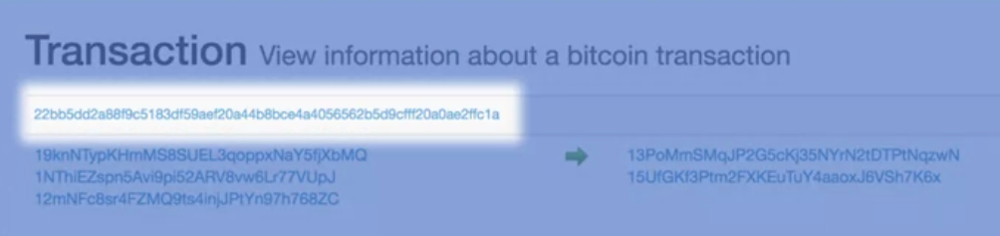
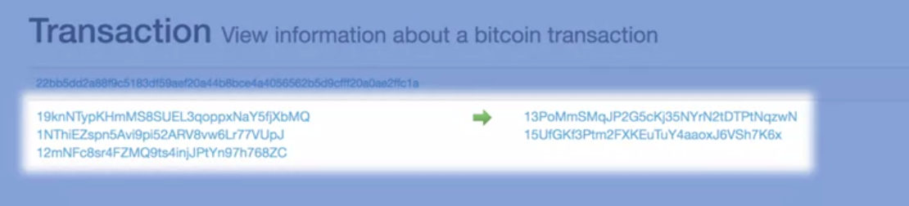
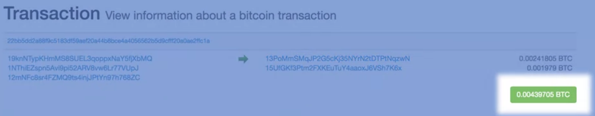
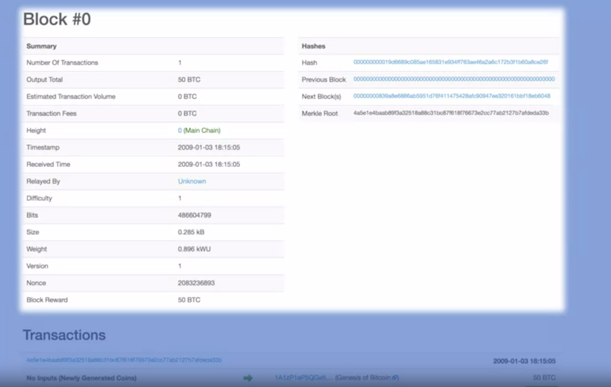
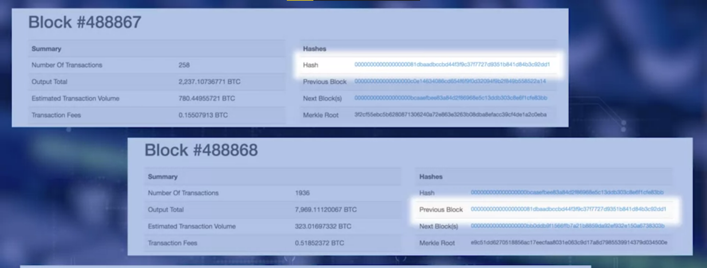

# Week 1
## BitCoin and Blockchain:
- Enable peer-to-peer transfer of digital assets without **intermediaries** in a **decentralised** network.
- Originally created to support BitCoin
- Trust between unknown peers
- Recording txn in an immutable ledger
- Establishing trust:
	- Validation
	- Verification
	- Consensus
	- Immutable recording
### Intro of bitcoin:
- contributions:
	- digital currency system
	- autonomous decentralised application
- Satoshi Nakamoto: new currency - BitCoin
- p2p transfer of value without any central authority
- Security and trust?
	- software programs for validation, verification, consensus in an infrastucture called **blockchain**.

## Blockchain Structure:
### Basic Structure of a blockchian:
- Transaction: basic element of bitcoin blockchain
- they're validated and broadcast
- many transactions -> form a block
- many blocks -> chain through a digital data link
- blocks need to be **verified** so they go through a **consensus** process to select next block that's to be added to the chian
- this **validation and consensus** are carried out by special peer nodes called "**miners**".
- miners: **powerful** computers executing the **software** that's defined by the "blockchain protocol".
### Single Transaction:
- Fundamental concept -> **Unspent Transaction Output** -> **UTXO**
- all UTXOs collectively **define the state** of the bitcoin blockchain
- referenced as "**inputs**" in a transaction, they're also "**outputs**" of a txn.
- stored by the participant nodes in the blockchain
- txn uses the "amount" specified in UTXOs and "transmits" it to newly created **output** UTXOs.
- UTXO:
	- **Unique identifier** of transaction that **created** the UTXO
	- **index/position** of the UTXO in the **txn output** list
	- **value/amount**
	- **conditions under which it can be spent** -> optional
- Txn:
	- **reference number** of "current txn"
	- refernce to >= 1 input **input UTXOs**
	- refernce to >= 1 input **output UTXOs** generated by the txn
	- total **input and output** amoutn
- Transaction Number

- amount in 3 input UTXOs is used to generate 2 new output UTXOs
- the numbers are the references to the UTXOs

- total amount vlaue transferred in bitcoins

- header and info
- set of valid txns
- genesis block -> introduced for future blocks -> block number zero
- this was created by Satoshi Nakamoto - one txn of 50 BTC 

- hash of prev block in in the next block

- txns -> transfer of value in the bitcoin blockchain
- UTXO -> defines inputs and outputs of a txn
- once block verified -> agreed by miners algorithmically -> added to chain of blocks -> **blockhain**
## Basic Operations:
## Beyond Bitcoin:
